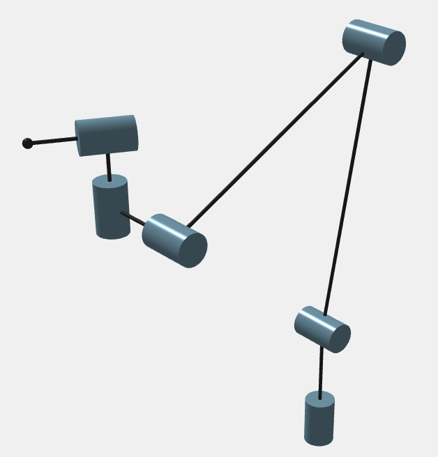
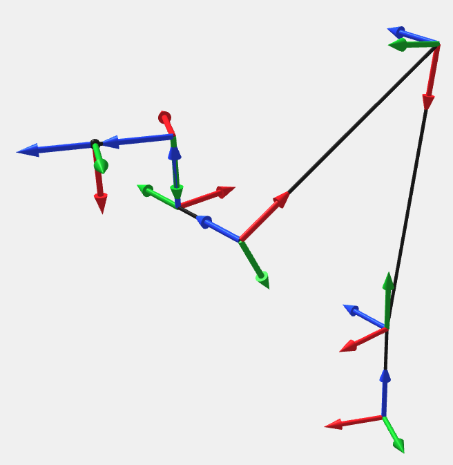
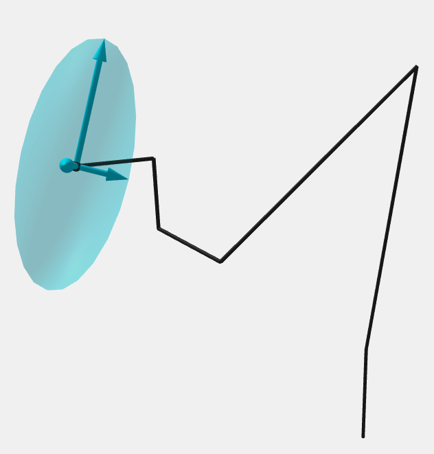

# IKDH

IKDH is an **Inverse Kinematics** solver based on the **Denavit and Hartenberg** convention. It finds **all solutions** for general six revolute joint robots based on the Husty and Pfurner algorithm [1] and [2].

---

## Web Interface
Web Interface can be accessed [here](https://lab-coro.github.io/IKDH/web/index.html).

|  |  |  |
| ------------------------------------------------------------ | ------------------------------------------------------------ | ---------------------------------------------------------------------------- |

Robots can be browsed and downloaded from the [RoboDK Robot Library](https://robodk.com/library). Once found, add your `.robot` file with `load` and the **DH parameters** will be directly extracted from it.

### Terminal Commands

- cartesian motion : ``MoveL x_mm, y_mm, z_mm, roll_deg, pitch_deg, yaw_deg``
  
  - set cartesian speed : ``SetSpeedL mm_per_s`` (default: 100 mm/s)

- joint motion : ``MoveJ J1_deg, J2_deg, J3_deg, J4_deg, J5_deg, J6_deg``
  
  - set joint speed : ``SetSpeedJ deg_per_s`` (default: 60 °/s)

---

## Library

build the project

```bash
cmake -B build -S .
cmake --build build
```

### Python example

```python
import sys; sys.path.insert(0, 'build')
import ikdh

robot  = ikdh.load_robot("robots/your_robot.yaml")
solver = ikdh.Solver(robot.dh, robot.limits)

#                            x      y    z      roll pitch yaw
ee   = ikdh.pose_from_xyzrpw(500.0, 0.0, 500.0, 0.0, 90.0, 0.0)
sols = solver.solve(ee)   # list of (6,) numpy arrays, in degrees

for q in sols:
    print(q)
```

### C++ example

```cpp
#include <ikdh.h>
#include <robots.h>
#include <cstdio>

int main()
{
    auto robot = Robots::loadRobot("robots/gofa5.yaml");
    IKDH::Solver solver(robot.dh, robot.limits);

    auto ee = IKDH::poseFromXYZRPW(500.0, 0.0, 500.0, 0.0, 90.0, 0.0);
    auto sols = solver.solve(ee);

    for (size_t i = 0; i < sols.size(); ++i) {
        for (double q : sols[i]) printf("%.3f ", q);
        printf("\n");
    }
}
```

---

### How to cite

```latex
@misc{axel_ikdh_2026,
  author       = {Axel Refalo},
  title        = {IKDH: An Inverse Kinematics Solver based Denavit and Hartenberg Convention},
  year         = {2026},
  publisher    = {GitHub},
  journal      = {GitHub Repository},
  howpublished = {\url{https://github.com/Lab-CORO/IKDH}},
}
```

---

## References

[1]    M. Husty, M. Pfurner and H.-P. Schröcker. A new and efficient algorithm for the inverse kinematics of a general serial 6R manipulator, *Mech. Mach. Theory* 42: 66–81, 2007.

[2]    J. Capco, M. J. C. Loquias, S. M. M. Manongsong and F. R. Nemenzo. Inverse Kinematics of Some General 6R/P Manipulators, *arXiv*:1906.07813, 2019.