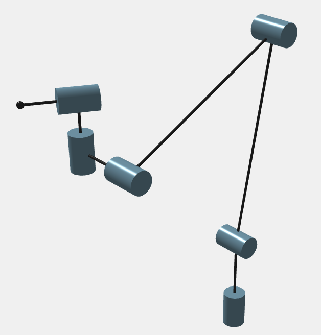
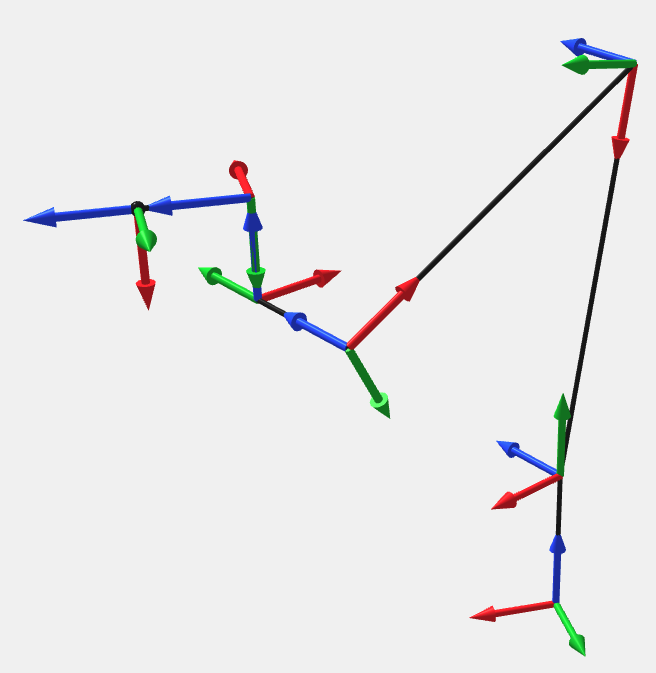
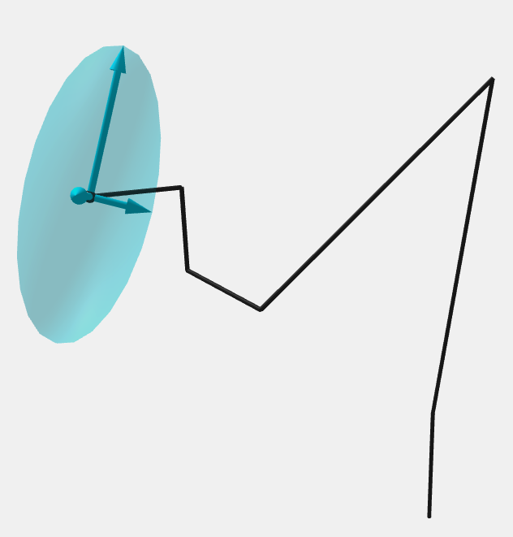

# IKDH

IKDH is a lightweight **Inverse Kinematics** solver based on the **Denavit and Hartenberg** convention. It finds **all solutions** for general six revolute joint robots using an analytic geometric Jacobian with Halton-seeded, damped Newton-Raphson multi-start refinement.

---

## Web Interface

Web Interface can be accessed [here](https://lab-coro.github.io/IKDH/web/ikdh.html).

|  |  |  |
| ------------------------------------------------------------ | ------------------------------------------------------------ | ---------------------------------------------------------------------------- |

Robots can be browsed and downloaded from the [RoboDK Robot Library](https://robodk.com/library). Once found, add your `.robot` file with `load` and the **DH parameters** will be directly extracted from it.

### Terminal Commands

- cartesian motion : ``MoveL x_mm, y_mm, z_mm, roll_deg, pitch_deg, yaw_deg``
  
  - set cartesian speed : ``SetSpeedL mm_per_s`` (default: 100 mm/s)

- joint motion : ``MoveJ J1_deg, J2_deg, J3_deg, J4_deg, J5_deg, J6_deg``
  
  - set joint speed : ``SetSpeedJ deg_per_s`` (default: 60 °/s)

---

## Library

Install the python

```bash
pip install ikdh
```

Or locally build the project

```bash
cmake -B build -S .
cmake --build build
```

Everything is built around a `Robot`, made from a DH table (either loaded from YAML or defined directly).

### Python example

```python
import ikdh

robot = ikdh.Robot.load_yaml("robots/your_robot.yaml")
# or define the DH parameters directly:
# robot = ikdh.Robot()
# robot.define_dh(a, d, alpha, theta, limits)

#                                  x      y    z      roll pitch yaw
ee   = ikdh.pose_from_xyzrpw(500.0, 0.0, 500.0, 0.0, 90.0, 0.0)
sols = robot.inverse_kinematics(ee)                # list of (6,) numpy arrays, in degrees
sols = robot.inverse_kinematics(ee, n_seeds=128)   # more Halton seeds = better odds of distant branches

q    = sols[0]
pose = robot.forward_kinematics(q)                 # (4, 4) numpy array

J   = robot.jacobian(q)                # (6, 6) numpy array
det = robot.jacobian_determinant(q)
mu  = robot.manipulability(q)          # sqrt(det(J J^T))

path = robot.move_l(ee, pose, q, n_points=50)      # joint angles from ee to pose, straight line in Cartesian space
path = robot.move_j(q, sols[1], n_points=50)       # joint angles from q to sols[1], straight line in joint space
```

### C++ example

```cpp
#include <robot.h>
#include <cstdio>

int main()
{
    auto robot = IKDH::Robot::loadYAML("robots/gofa5.yaml");

    auto ee   = IKDH::poseFromXYZRPW(500.0, 0.0, 500.0, 0.0, 90.0, 0.0);
    auto sols = robot.inverseKinematics(ee);
    // auto sols = robot.inverseKinematics(ee, 128);  // n_seeds

    auto q    = sols[0];
    auto pose = robot.forwardKinematics(q);

    auto   J   = robot.jacobian(q);
    double det = robot.jacobianDeterminant(q);
    double mu  = robot.manipulability(q);

    auto path  = robot.moveL(ee, pose, q, 50);
    auto path2 = robot.moveJ(q, sols[1], 50);

    for (double v : path.back()) printf("%.3f ", v);
    printf("\n");
}
```

---

### How to cite

```latex
@misc{ikdh2026,
  author       = {Axel Refalo},
  title        = {IKDH: An Inverse Kinematics Solver based Denavit and Hartenberg Convention},
  year         = {2026},
  publisher    = {GitHub},
  journal      = {GitHub Repository},
  howpublished = {\url{https://github.com/Lab-CORO/IKDH}},
}
```